# Buddy packs

Optional Persona Buddy visuals, states and animations: **22 finished packs** and
six separately labelled authoring scaffolds. Three reference characters join the
twelve original companions and seven shipped defaults. All use native
`.tldw-persona-vpack` archives.

## Dipsy, Kimi and Cappy

Three new packs adapted from the supplied illustration, whose creator is credited
to **anonymous**. Each includes sixteen anchored poses, eighteen state mappings,
a native download and static/animated previews. Dipsy (Qipao) is a separate pack
from the blue-whale Dipsy below.

| Dipsy (Qipao) | Kimi | Cappy |
| --- | --- | --- |
|  | [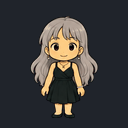](kimi/) | [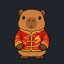](cappy/) |

Pack creator: **tldw-project**. Reference credit and its unpublished license status
are retained in each pack's NOTICE.txt and native archive.
[Verification](../docs/reference-trio-verification.md) ·
[Archive sizes and checksums](reference-trio-verification.json).

## New companion collection

Twelve original 2D companions, matching the existing Buddy artwork. Version 1.0.1
corrects Shiba paw anatomy and keeps animated poses anchored. Each
includes a native download, transparent source art, still preview, animated
preview, and reactions. Select a name or image for files and import steps.

| Buddy | Buddy | Buddy |
| --- | --- | --- |
| [**Woodpecker**](woodpecker/) <a href="woodpecker/">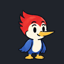</a> | [**Rubber Duck**](rubber-duck/) <a href="rubber-duck/">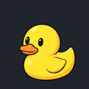</a> | [**Werewolf**](werewolf/) <a href="werewolf/">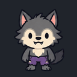</a> |
| [**Circle**](circle/)  | [**Square**](square/) <a href="square/">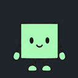</a> | [**Rhombus**](rhombus/) <a href="rhombus/">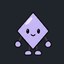</a> |
| [**Octagon**](octagon/) <a href="octagon/">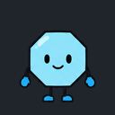</a> | [**Triangle**](triangle/) <a href="triangle/">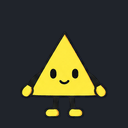</a> | [**Trenchcoat**](trenchcoat/) <a href="trenchcoat/">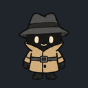</a> |
| [**Shiba-inu**](shiba-inu/) <a href="shiba-inu/">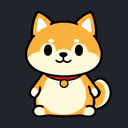</a> | [**Dipsy**](dipsy/)  | [**Ghosty**](ghosty/)  |

All twelve are credited to **tldw-project** and use Apache-2.0 for their
new artwork and metadata. The defaults below retain their existing terms.
[Verification](../docs/buddy-collection-verification.md) ·
[Archive inventory and checksums](companions-verification.json).

## Shipped defaults

Preview the actual artwork before downloading. Select an image or name for
the archive, import steps and licensing. These are the packs’ original preview
PNGs, displayed enlarged; animation states are included in each download.

| Buddy | Buddy | Buddy |
| --- | --- | --- |
| [**Search Lens Basic**](search-lens-basic/)  | [**Index Card Basic**](index-card-basic/)  | [**Archive Cube Basic**](archive-cube-basic/)  |
| [**Paperclip Basic**](paperclip-basic/)  | [**Terminal Tile Basic**](terminal-tile-basic/)  | [**Migu Marker Basic**](migu-marker-basic/)  |
| [**pixel-migu**](pixel-migu/)  |  |  |

- [Search Lens Basic](search-lens-basic/) — Bundled art-ready basic Buddy default: friendly magnifying-glass research helper with approved 3x4 source-sheet frames.
- [Index Card Basic](index-card-basic/) — Bundled art-ready basic Buddy default: animated tabbed index-card research helper with approved 3x4 source-sheet frames.
- [Archive Cube Basic](archive-cube-basic/) — Bundled art-ready basic Buddy default: compact archive cube helper with approved 3x4 source-sheet frames.
- [Paperclip Basic](paperclip-basic/) — Bundled art-ready basic Buddy default: expressive paperclip helper with approved 3x4 source-sheet frames.
- [Terminal Tile Basic](terminal-tile-basic/) — Bundled art-ready basic Buddy default: compact terminal-window tile helper with approved 3x4 source-sheet frames.
- [Migu Marker Basic](migu-marker-basic/) — Bundled art-ready basic Buddy default: playful marker-line Migu helper with approved 3x4 source-sheet frames.
- [pixel-migu](pixel-migu/) — Turquoise pixel-art robot companion with twin tails, state loops and expression poses.

The historical `research-buddy-starter` ID resolves to **Search Lens Basic**;
it is an alias, not an additional pack. Pixel-migu's native manifest values
and all 64 PNGs match the Chatbook built-in, so a single archive serves both.

## Default personas

The [six default persona archetypes](../personas/README.md) are also published.
Their Buddy species/palette/silhouette fields are setup seed metadata, not
references to these visual archives. Follow the
[Persona and Buddy relationship](../personas/README.md#buddy-companions) and
[import steps](IMPORT.md) to choose a visual pack for a saved Persona.

## Authoring references

[Six shipped scaffolds](scaffolds/) preserve the intermediate/intricate catalog
recipes and format examples. Their 4 × 4 fixture art is unfinished; they are
separate from the finished pack list.

## Import and provenance

[Import steps and verification scope](IMPORT.md) ·
[Archive sizes and checksums](verification.json) ·
[Upstream license scope](UPSTREAM_LICENSE.md) · [GPL-3.0-only text](LICENSE).
Pixel-migu artwork retains its specific supplied-art notices. Each item records
its provenance and limitations. No optional content installs automatically.

To contribute another item, follow [CONTRIBUTING.md](../CONTRIBUTING.md) and the
[content README template](../templates/content-README.md).
