# Buddy packs

Browse optional Buddy artwork, expressions and animations. Each **Download**
link opens a native `.tldw-persona-vpack` archive; **Details** opens the pack's
previews, import steps and credits.

[How to import a Buddy](IMPORT.md) · [Default personas](#default-personas) · [Credits and licenses](#import-and-provenance)

## Finished packs

[Characters](#characters) · [Animals and creatures](#animals-and-creatures) · [Shapes](#shapes) · [Shipped defaults](#shipped-defaults)

### Characters

<table>
  <tr>
    <td width="384" align="center" valign="top">
      <a href="dipsy-qipao/"><strong>Dipsy (Qipao)</strong> </a> 
      Blue qipao and expressive reactions. 
      <a href="dipsy-qipao/">Details</a> · <a href="dipsy-qipao/dipsy-qipao.tldw-persona-vpack?raw=1">Download</a>
    </td>
    <td width="384" align="center" valign="top">
      <a href="kimi/"><strong>Kimi</strong> </a> 
      Silver hair and a black dress. 
      <a href="kimi/">Details</a> · <a href="kimi/kimi.tldw-persona-vpack?raw=1">Download</a>
    </td>
  </tr>
  <tr>
    <td width="384" align="center" valign="top">
      
      <a href="teto/"><strong>Teto</strong> </a> 
      Red twin tails in a marker-drawn style. 
      <a href="teto/">Details</a> · <a href="teto/teto.tldw-persona-vpack?raw=1">Download</a>
    </td>
    <td width="384" align="center" valign="top">
      <a href="trenchcoat/"><strong>Trenchcoat</strong> </a> 
      A mysterious companion in a trenchcoat. 
      <a href="trenchcoat/">Details</a> · <a href="trenchcoat/trenchcoat.tldw-persona-vpack?raw=1">Download</a>
    </td>
  </tr>
  <tr>
    <td width="384" align="center" valign="top">
      
      <a href="un-aligned-waifu/"><strong>un-aligned waifu</strong> </a> 
      Blonde twin tails, red eyes and a knife prop. 
      <a href="un-aligned-waifu/">Details</a> · <a href="un-aligned-waifu/un-aligned-waifu.tldw-persona-vpack?raw=1">Download</a>
    </td>
    <td width="384"></td>
  </tr>
</table>

### Animals and creatures

<table>
  <tr>
    <td width="384" align="center" valign="top">
      <a href="cappy/"><strong>Cappy</strong> 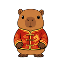</a> 
      A capybara in a red jacket. 
      <a href="cappy/">Details</a> · <a href="cappy/cappy.tldw-persona-vpack?raw=1">Download</a>
    </td>
    <td width="384" align="center" valign="top">
      
      <a href="cat/"><strong>Cat</strong> 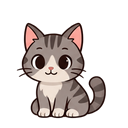</a> 
      A gray tabby with whiskers and a curled tail. 
      <a href="cat/">Details</a> · <a href="cat/cat.tldw-persona-vpack?raw=1">Download</a>
    </td>
  </tr>
  <tr>
    <td width="384" align="center" valign="top">
      <a href="dipsy/"><strong>Dipsy (Blue Whale)</strong> </a> 
      A friendly blue whale. 
      <a href="dipsy/">Details</a> · <a href="dipsy/dipsy.tldw-persona-vpack?raw=1">Download</a>
    </td>
    <td width="384" align="center" valign="top">
      <a href="ghosty/"><strong>Ghosty</strong> </a> 
      A little white sheet ghost. 
      <a href="ghosty/">Details</a> · <a href="ghosty/ghosty.tldw-persona-vpack?raw=1">Download</a>
    </td>
  </tr>
  <tr>
    <td width="384" align="center" valign="top">
      
      <a href="horse/"><strong>Horse</strong> 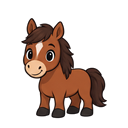</a> 
      Chestnut coat, white blaze and an expressive tail. 
      <a href="horse/">Details</a> · <a href="horse/horse.tldw-persona-vpack?raw=1">Download</a>
    </td>
    <td width="384" align="center" valign="top">
      
      <a href="llama/"><strong>Llama</strong> 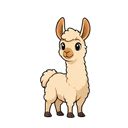</a> 
      Cream-colored wool and expressive ears. 
      <a href="llama/">Details</a> · <a href="llama/llama.tldw-persona-vpack?raw=1">Download</a>
    </td>
  </tr>
  <tr>
    <td width="384" align="center" valign="top">
      
      <a href="pelican-bicycle/"><strong>Pelican on a Bicycle</strong> 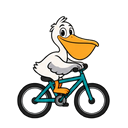</a> 
      A pelican pedaling a teal bicycle. 
      <a href="pelican-bicycle/">Details</a> · <a href="pelican-bicycle/pelican-bicycle.tldw-persona-vpack?raw=1">Download</a>
    </td>
    <td width="384" align="center" valign="top">
      
      <a href="pepe/"><strong>Pepe</strong> </a> 
      A squat, round-bellied frog in a blue shirt. 
      <a href="pepe/">Details</a> · <a href="pepe/pepe.tldw-persona-vpack?raw=1">Download</a>
    </td>
  </tr>
  <tr>
    <td width="384" align="center" valign="top">
      
      <a href="poodle/"><strong>Poodle</strong> </a> 
      Cream curls, floppy ears and a pom-pom tail. 
      <a href="poodle/">Details</a> · <a href="poodle/poodle.tldw-persona-vpack?raw=1">Download</a>
    </td>
    <td width="384" align="center" valign="top">
      <a href="rubber-duck/"><strong>Rubber Duck</strong> </a> 
      A cheerful rubber-duck companion. 
      <a href="rubber-duck/">Details</a> · <a href="rubber-duck/rubber-duck.tldw-persona-vpack?raw=1">Download</a>
    </td>
  </tr>
  <tr>
    <td width="384" align="center" valign="top">
      <a href="shiba-inu/"><strong>Shiba-inu</strong> </a> 
      A Shiba-inu with expressive paws and ears. 
      <a href="shiba-inu/">Details</a> · <a href="shiba-inu/shiba-inu.tldw-persona-vpack?raw=1">Download</a>
    </td>
    <td width="384" align="center" valign="top">
      
      <a href="unicorn/"><strong>Unicorn</strong> 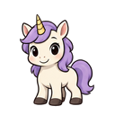</a> 
      Lavender mane, golden horn and gentle reactions. 
      <a href="unicorn/">Details</a> · <a href="unicorn/unicorn.tldw-persona-vpack?raw=1">Download</a>
    </td>
  </tr>
  <tr>
    <td width="384" align="center" valign="top">
      <a href="werewolf/"><strong>Werewolf</strong> 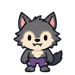</a> 
      A small, expressive werewolf. 
      <a href="werewolf/">Details</a> · <a href="werewolf/werewolf.tldw-persona-vpack?raw=1">Download</a>
    </td>
    <td width="384" align="center" valign="top">
      <a href="woodpecker/"><strong>Woodpecker</strong> 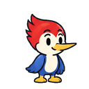</a> 
      A red-crested bird with a blue body. 
      <a href="woodpecker/">Details</a> · <a href="woodpecker/woodpecker.tldw-persona-vpack?raw=1">Download</a>
    </td>
  </tr>
</table>

### Shapes

<table>
  <tr>
    <td width="384" align="center" valign="top">
      <a href="circle/"><strong>Circle</strong> </a> 
      A round geometric companion. 
      <a href="circle/">Details</a> · <a href="circle/circle.tldw-persona-vpack?raw=1">Download</a>
    </td>
    <td width="384" align="center" valign="top">
      <a href="octagon/"><strong>Octagon</strong> </a> 
      An eight-sided geometric companion. 
      <a href="octagon/">Details</a> · <a href="octagon/octagon.tldw-persona-vpack?raw=1">Download</a>
    </td>
  </tr>
  <tr>
    <td width="384" align="center" valign="top">
      <a href="rhombus/"><strong>Rhombus</strong> 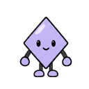</a> 
      A diamond-shaped geometric companion. 
      <a href="rhombus/">Details</a> · <a href="rhombus/rhombus.tldw-persona-vpack?raw=1">Download</a>
    </td>
    <td width="384" align="center" valign="top">
      <a href="square/"><strong>Square</strong> 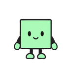</a> 
      A square geometric companion. 
      <a href="square/">Details</a> · <a href="square/square.tldw-persona-vpack?raw=1">Download</a>
    </td>
  </tr>
  <tr>
    <td width="384" align="center" valign="top">
      <a href="triangle/"><strong>Triangle</strong> 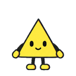</a> 
      A three-sided geometric companion. 
      <a href="triangle/">Details</a> · <a href="triangle/triangle.tldw-persona-vpack?raw=1">Download</a>
    </td>
    <td width="384"></td>
  </tr>
</table>

### Shipped defaults

The original basic Buddy packs, available here as separate downloads.

<table>
  <tr>
    <td width="384" align="center" valign="top">
      <a href="archive-cube-basic/"><strong>Archive Cube Basic</strong> 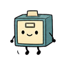</a> 
      A compact archive-cube helper. 
      <a href="archive-cube-basic/">Details</a> · <a href="archive-cube-basic/archive-cube-basic.tldw-persona-vpack?raw=1">Download</a>
    </td>
    <td width="384" align="center" valign="top">
      <a href="index-card-basic/"><strong>Index Card Basic</strong> </a> 
      A tabbed index-card helper. 
      <a href="index-card-basic/">Details</a> · <a href="index-card-basic/index-card-basic.tldw-persona-vpack?raw=1">Download</a>
    </td>
  </tr>
  <tr>
    <td width="384" align="center" valign="top">
      <a href="migu-marker-basic/"><strong>Migu Marker Basic</strong> </a> 
      A playful, marker-drawn Migu. 
      <a href="migu-marker-basic/">Details</a> · <a href="migu-marker-basic/migu-marker-basic.tldw-persona-vpack?raw=1">Download</a>
    </td>
    <td width="384" align="center" valign="top">
      <a href="paperclip-basic/"><strong>Paperclip Basic</strong> </a> 
      An expressive paperclip helper. 
      <a href="paperclip-basic/">Details</a> · <a href="paperclip-basic/paperclip-basic.tldw-persona-vpack?raw=1">Download</a>
    </td>
  </tr>
  <tr>
    <td width="384" align="center" valign="top">
      <a href="pixel-migu/"><strong>pixel-migu</strong> 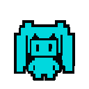</a> 
      A turquoise pixel-art companion with twin tails. 
      <a href="pixel-migu/">Details</a> · <a href="pixel-migu/pixel-migu.tldw-persona-vpack?raw=1">Download</a>
    </td>
    <td width="384" align="center" valign="top">
      <a href="search-lens-basic/"><strong>Search Lens Basic</strong> </a> 
      A magnifying-glass research helper. 
      <a href="search-lens-basic/">Details</a> · <a href="search-lens-basic/search-lens-basic.tldw-persona-vpack?raw=1">Download</a>
    </td>
  </tr>
  <tr>
    <td width="384" align="center" valign="top">
      <a href="terminal-tile-basic/"><strong>Terminal Tile Basic</strong> </a> 
      A compact terminal-window helper. 
      <a href="terminal-tile-basic/">Details</a> · <a href="terminal-tile-basic/terminal-tile-basic.tldw-persona-vpack?raw=1">Download</a>
    </td>
    <td width="384"></td>
  </tr>
</table>

## Default personas

The [six default persona archetypes](../personas/README.md) are available
separately. They define persona setup metadata; choose a visual Buddy pack
for a saved Persona using the [import steps](IMPORT.md).
See [how Personas and Buddies relate](../personas/README.md#buddy-companions).

## Authoring references

[Six unfinished scaffolds](scaffolds/) contain catalog recipes and format
examples for pack authors. Their fixture artwork is separate from the
finished downloads above.

To contribute a pack, follow [CONTRIBUTING.md](../CONTRIBUTING.md) and the
[content README template](../templates/content-README.md).

## Import and provenance

Pack creator: **tldw-project**. Original contributions follow the repository's
Apache-2.0 default; shipped defaults and adapted characters retain their
specific artwork, source and license notices. See [LICENSING.md](../LICENSING.md)
and each pack's details before reuse.

Pepe credits character creator **Matt Furie**. The supplied references for
Dipsy (Qipao), Kimi, Cappy, Teto and un-aligned waifu credit **anonymous**;
their notices retain the reference artwork's unpublished license status.

[Import steps](IMPORT.md) · [Shipped-default verification scope](IMPORT.md#verification-scope) ·
[Upstream license scope](UPSTREAM_LICENSE.md) · [GPL-3.0-only text](LICENSE)

Verification records and archive checksums:

- **Shipped defaults:** [Method and limits](IMPORT.md#verification-scope) · [Archive inventory](verification.json).
- **Original twelve companions:** [Verification report](../docs/buddy-collection-verification.md) · [Archive inventory](companions-verification.json).
- **Dipsy (Qipao), Kimi and Cappy:** [Verification report](../docs/reference-trio-verification.md) · [Archive inventory](reference-trio-verification.json).
- **Individual packs:** verification records and checksums are linked from each pack's details.
