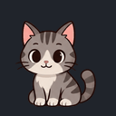

# Cat

A seated gray tabby cat with a pale muzzle and chest, short whiskers and a curled striped tail. It blinks, thinks, meows and flicks its tail while its paws stay planted.

## Preview and download

 

[**Download Cat**](cat.tldw-persona-vpack) · 232,286 bytes · [SHA-256 checksums](SHA256SUMS)

The still is the exact idle frame. The GIF cycles through actual pack frames on
a dark background; downloadable PNG artwork has transparency. These are artwork
previews, not application screenshots.

## Details

| Field | Value |
| --- | --- |
| Content version | 1.0.0 |
| Type | Native Persona Buddy visual pack |
| Creator | tldw-project |
| Source | Original AI-assisted artwork for this collection |
| License | [Apache-2.0](LICENSE.txt) |
| Target | Chatbook and tldw_server native Buddy importers |
| Contents | 16 poses, 18 state mappings, one 512 × 512 transparent atlas with 128 × 128 frames |
| Animation | Idle/blink, thinking, speaking, greeting and celebration sequences; still reactions |
| Tested with | Chatbook `b4e460f751`; server `27cd027555` |
| Verified on | 2026-09-08 |

## Import and use

Download the native archive using GitHub's **Download raw file** button. In
Chatbook, save or select a local Persona, then use **Persona Visual → Import
Pack…**, review the states, and **Save Pack**. The server uses its native import
preview/commit flow. See [complete import steps](../IMPORT.md).

Requirements: a build with native Buddy import support. The finished pack needs
no image-generation service, model download or Petdex tool. It is optional content.

In a Chatbook build with Buddy-to-character conversion, use **Create character…**
in Persona Visual to make an independent editable character with these reactions.
It can emote in the Console without the floating Buddy enabled. **Settings →
Appearance → Character expressions** selects Dynamic or Static. Static still
changes expressions but freezes animation; Reduce motion takes precedence.
Older builds may support Buddy import without these newer character features.

## States and source artwork

Operational states: `idle`, `wake_armed`, `listening`, `thinking`, `speaking`,
`tool_running`, `approval_needed`, `error`, and `offline`. For example, a running
tool selects the thinking loop; an approval selects confused; offline selects
sleepy. Additional greeting, happy, success, neutral, thinking, sleepy, confused
and love mappings intentionally share some artwork. See [manifest.json](manifest.json).

[source.png](source.png) contains all sixteen poses:

| Row | Column 1 | Column 2 | Column 3 | Column 4 |
| --- | --- | --- | --- | --- |
| 1 | Idle | Alternate (unused) | Blink | Neutral (unused) |
| 2 | Thinking | Thinking alternate | Speaking | Speaking alternate |
| 3 | Listening | Sleepy | Worried/error | Confused |
| 4 | Greeting | Happy | Celebrate | Love |

Local preparation preserved the generated alpha, removed faint stray pixels,
extracted complete animals and nearby effects, and applied one common scale.
Every frame uses support center x=64 and baseline y=118. Blink and speaking change
only facial regions over a fixed base; thinking changes detached thought dots.
[PROMPT.txt](PROMPT.txt) records the built-in image-generation prompt;
[recipe.json](recipe.json) records extraction, registration and local pose changes.

## Verification and rebuilding

[Exact archive digests and results](verification.json) record the tested bytes.
The native archive passed Chatbook import review, publication, reload,
export/re-read, animated/static frame selection, conversion into eighteen
expressions and independent character publication. Neutral, thinking and
speaking expressions contain multiple frames. Creator and full license notices
survived export and character publication.

The same archive passed server preview, committed untrusted import into an
inactive draft, exact asset checksums and activatable-manifest validation.
Tests used private temporary profiles and real SQLite databases, with only the
server asset-root locator redirected to temporary storage. No live application
UI or server HTTP-worker testing is claimed.

All sixteen poses were visually reviewed for identity, anatomy, framing and
alignment. Artifact checks verified transparency, clear margins, support anchors,
exact still previews, GIF animation, archive integrity and file hashes.

With the [documented application environments](../../docs/buddy-collection-verification.md#reproduce-and-rebuild), run from this repository:

```sh
python scripts/build_buddy_collection.py buddy-packs/cat
python tests/check_buddy_collection.py --host chatbook --pack cat
python tests/check_buddy_collection.py --host server --pack cat
```

The builder consumes the reviewed atlas and does not call image generation or
modify installed content. ADR required: no; the pack uses existing native visual
and character-expression contracts without application changes.

## Attribution and updates

Artwork and pack creator: **tldw-project**. The built-in OpenAI image tool created
original artwork from the user's concept and a description of the collection's
cartoon style, informed by [Llama](../llama/), [Shiba-inu](../shiba-inu/),
[Rubber Duck](../rubber-duck/) and [Cappy](../cappy/). Their image pixels are not
included in this new atlas. [PROVENANCE.json](PROVENANCE.json) records the source
digest and preparation method. Local image processing was user-authorized.

Keep [LICENSE.txt](LICENSE.txt) and provenance with copies. The native archive
embeds the creator and full license text. Chatbook preserves them; server tests
cover imported visuals, not notice retention through a later server export.

For updates, import into a new Persona/draft and compare before switching.
Downloaded and customized copies remain independent and never update automatically.
