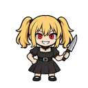
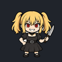

# un-aligned waifu

A blonde, red-eyed companion with twin ponytails, a black dress and lace choker,
and a silver knife prop. The supplied poster's design becomes a full-body chibi
Buddy with a mischievous grin and reactions that face the user.

## Preview and download

 

[**Download un-aligned waifu**](un-aligned-waifu.tldw-persona-vpack) · 246,881 bytes · [SHA-256 checksums](SHA256SUMS)

The still is the exact idle frame. The GIF cycles through actual pack frames on
a dark background; the downloadable PNG artwork is transparent. These are
artwork previews, not application screenshots.

## Details

| Field | Value |
| --- | --- |
| Content version | 1.0.0 |
| Pack creator | tldw-project |
| Attribution | Reference artwork creator: anonymous (artist unidentified) |
| License | [Apache-2.0](LICENSE.txt) for project contributions to the extent applicable; reference and character rights remain separate in [NOTICE.txt](NOTICE.txt) |
| Contents | 16 poses, 18 state mappings, one 512 × 512 transparent atlas with 128 × 128 frames |
| Animation | Idle/blink, thinking, speaking, greeting and celebration sequences; still reaction poses |
| Orientation | Looks toward the user, with a common body scale and planted feet |
| Tested | Chatbook `b4e460f751`; server `27cd027555`; 2026-09-08 |

## Import and use

Download the native archive using GitHub's **Download raw file** button. In
Chatbook, save or select a local Persona, then use **Persona Visual → Import
Pack…**, review the states, and **Save Pack**. The server uses its native import
preview/commit flow. See [complete import steps](../IMPORT.md).

The finished pack needs no image-generation service, model download or Petdex
tool. It is optional collection content and does not replace an application default.

In a Chatbook build with Buddy-to-character conversion, use **Create character…**
in Persona Visual to make an independent editable character with these reactions.
It can emote in the Console without the floating Buddy enabled. **Settings →
Appearance → Character expressions** selects Dynamic or Static. Static still
changes expressions but freezes animation; Reduce motion takes precedence.
Older builds may support Buddy import without those newer character features.

For example, the Buddy thinks during tool activity, looks confused when approval
is needed, and celebrates success. See [manifest.json](manifest.json) for the
eighteen operational, reaction and mood mappings; some intentionally share artwork.

## Source artwork

[source.png](source.png) contains the sixteen poses, read left to right:

| Row | Column 1 | Column 2 | Column 3 | Column 4 |
| --- | --- | --- | --- | --- |
| 1 | Idle | Neutral alternate (unused) | Blink | Neutral (unused) |
| 2 | Thinking | Thinking alternate | Speaking | Speaking alternate |
| 3 | Listening | Sleepy | Worried/error | Confused |
| 4 | Wave | Happy | Celebrate | Love |

The built-in OpenAI image tool adapted the poster into new full-body drawings.
Authorized local processing removed the painted checkerboard, preserved opaque
white details and gray blades, separated complete poses, applied one scale, and
aligned the feet to x=64 and y=118 in every cell. Blink, thinking and speaking
loops reuse unchanged body and prop regions. The happy pose uses the idle body
with its generated happy face, removing an extra arm from the generated sheet.
[PROMPT.txt](PROMPT.txt) and [recipe.json](recipe.json) record generation and preparation.

## Verification and rebuilding

[verification.json](verification.json) records the exact tested archive digest.
Chatbook checks passed native import review, publication, reload, export/re-read,
animated/static frame selection, conversion into eighteen expressions, independent
character publication, and attribution retention. Neutral, thinking and speaking
expressions contain multiple frames.

Server checks passed preview, committed untrusted import into an inactive draft,
exact asset checksums and activatable-manifest validation. Tests used private
temporary profiles and real SQLite databases, with only the server asset-root
locator redirected to temporary storage. No live UI or HTTP-worker testing is claimed.

All poses were visually reviewed for identity, anatomy, framing and alignment.
Artifact checks verified transparency, clear margins, support anchors, still/GIF
previews, archive integrity and file hashes.

With the [documented application environments](../../docs/buddy-collection-verification.md#reproduce-and-rebuild), run from this repository:

```sh
python scripts/build_buddy_collection.py buddy-packs/un-aligned-waifu
python tests/check_buddy_collection.py --host chatbook --pack un-aligned-waifu
python tests/check_buddy_collection.py --host server --pack un-aligned-waifu
```

The builder consumes the reviewed atlas without image generation or changes to
installed content. ADR required: no; this pack uses existing native visual and
character-expression contracts without application changes.

## Attribution and updates

The reference is the user-supplied `align-waifu.jpg` poster, credited to
**anonymous** because its artist is unidentified. Its SHA-256 identifies the
reference in [PROVENANCE.json](PROVENANCE.json); no public source URL or published
license was supplied or verified. The original poster is not bundled and its
lettering is omitted from the sprites. un-aligned waifu is the user-selected name for this pack. Reference-artwork and character rights
remain separate from the project contributions.

Project contributions use Apache-2.0 to the extent applicable. Keep
[LICENSE.txt](LICENSE.txt), [NOTICE.txt](NOTICE.txt) and provenance with copies.
The archive embeds the creator, full license and attribution notice, which
Chatbook preserves through export and character publication. Server checks cover
imported visuals, not notice retention through a later export, so retain the
accompanying files.

For an update, import into a new Persona/draft and compare before switching.
Downloaded and customized copies remain independent and never update automatically.
